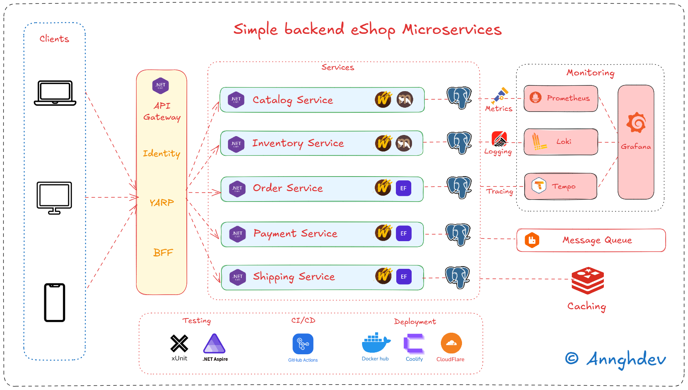

# Simple eShop Microservices



**EN:** A simplified e-commerce backend microservices simulation on .NET for learning purposes, with CQRS, event-driven messaging, and observability. Not intended as a production-ready system.  
**VI:** Hệ thống backend e-commerce mô phỏng microservices đơn giản trên .NET, phục vụ mục đích học tập, áp dụng CQRS, giao tiếp hướng sự kiện và quan sát hệ thống. Không phải dự án production thực tế.

## Table of Contents | Mục lục

- [Overview | Tổng quan](#overview--tong-quan)
- [Architectures and Patterns | Kiến trúc và mẫu thiết kế](#architectures-and-patterns--kien-truc-va-mau-thiet-ke)
- [Technologies | Công nghệ](#technologies--cong-nghe)
- [Services | Dịch vụ] (#services--dich-vu)
- [Core Flows | Luồng nghiệp vụ chính](#core-flows--luong-nghiep-vu-chinh)
- [Current State | Hiện trạng dự án](#current-state--hien-trang-du-an)
- [Testing | Kiểm thử] (#testing--kiem-thu)
- [Setup Guide | Hướng dẫn cài đặt](#setup-guide--huong-dan-cai-dat)

## Overview | Tổng quan

**EN**
- This project demonstrates how to design, build, and run an e-commerce platform using a distributed microservices architecture.
- The solution focuses on product catalog, inventory, ordering, payment, shipping, and API gateway concerns.
- It is intended for learning, experimentation, and as a reference foundation for production-grade patterns.

**VI**
- Dự án này trình bày cách thiết kế, xây dựng và vận hành một nền tảng e-commerce theo kiến trúc microservices phân tán.
- Phạm vi giải quyết gồm catalog sản phẩm, tồn kho, đặt hàng, thanh toán, vận chuyển và API gateway.
- Mục tiêu hướng đến học tập, thử nghiệm, và làm nền tảng tham khảo cho các pattern gần với môi trường production.

```
📁 src/
├── APIGateway/             # API Gateway (ASP.NET Core)
├── Aspire/                 # Infrastructure resource environment setup, application orchestration and centralized management
├── services/               # Core services
│   ├── Catalog/            # Product management
│   ├── Inventory/          # Inventory management
│   ├── Order/				# Order management
│   ├── Payment/			# Payment processing
│   ├── Shipping/			# Shipping management
├── Shared/					# Shared between services
│   ├── Contracts/          # Public Events, gRPC proto contracts, shared enums/constants
│   └── Kernel/             # Core abstractions, framework library
📁 Tests/				    # Testing
```

## Architectures and Patterns | Kiến trúc và mẫu thiết kế

**EN**
- **Microservices architecture:** each bounded context is deployed independently and communicates through APIs/events.
- **Vertical Slice architecture:** features are organized by business capability (commands, queries, handlers, validators) instead of technical layers.
- **CQRS:** command/query separation and asynchronous integration.
- **Event-Driven Messaging:** services publish and consume integration events across exchanges/queues.
- **Domain-Driven Design (DDD):** core business rules are modeled around domain concepts (aggregates, value objects, domain events) and bounded contexts.
- **Event Sourcing (selective):** key domain changes are represented as events to support auditability and asynchronous consistency in business flows.
- **Saga pattern:** long-running cross-service workflows (order, inventory, payment, shipping) are coordinated through events and compensating actions.
- **API Gateway pattern:** a single gateway handles auth, authorization, rate limiting, and reverse proxy routing.
- **Resilience patterns:** durable outbox, retries, and error queues for reliable message processing.

**VI**
- **Kiến trúc microservices:** mỗi bounded context được triển khai độc lập và giao tiếp qua API/sự kiện.
- **Vertical Slice:** tổ chức code theo năng lực nghiệp vụ (command, query, handler, validator), không chia theo tầng kỹ thuật truyền thống.
- **CQRS:** tách biệt đọc/ghi và hỗ trợ xử lý bất đồng bộ.
- **Giao tiếp hướng sự kiện:** các service pub/sub integration event qua exchange/queue.
- **Thiết kế hướng miền (DDD):** mô hình hóa nghiệp vụ quanh các khái niệm domain (aggregate, value object, domain event) và bounded context.
- **Event Sourcing (chọn lọc):** một số thay đổi domain quan trọng được biểu diễn dưới dạng sự kiện để hỗ trợ audit và đảm bảo nhất quán bất đồng bộ.
- **Saga pattern:** điều phối các quy trình dài qua nhiều service (order, inventory, payment, shipping) bằng sự kiện và cơ chế bù trừ.
- **API Gateway pattern:** một điểm vào duy nhất cho xác thực, phân quyền, giới hạn tốc độ, và reverse proxy.
- **Độ bền hệ thống:** dùng durable outbox, retry, và error queue để tăng độ tin cậy xử lý message.

## Technologies | Công nghệ

**EN**
- **Platform:** .NET 10, ASP.NET Core Web API.
- **Service orchestration (dev):** .NET Aspire AppHost (v13), Docker Compose.
- **Messaging:** Wolverine v5, RabbitMQ.
- **Data:** PostgreSQL, Marten v8 (Catalog, Inventory), EF Core 10 + Npgsql (Order, Payment, Shipping, Auth).
- **API communication:** HTTP (through gateway) + gRPC for selected service-to-service flows.
- **Caching:** Redis.
- **Validation:** FluentValidation (via Wolverine integration).
- **Observability:** OpenTelemetry, Prometheus, Loki, Jaeger, Tempo, Grafana.
- **Gateway:** YARP reverse proxy + JWT auth/authorization.

**VI**
- **Nền tảng:** .NET 10, ASP.NET Core Web API.
- **Điều phối môi trường dev:** .NET Aspire AppHost (v13), Docker Compose.
- **Messaging:** Wolverine v5, RabbitMQ.
- **Dữ liệu:** PostgreSQL, Marten v8 (Catalog, Inventory), EF Core 10 + Npgsql (Order, Payment, Shipping, Auth).
- **Giao tiếp API:** HTTP (qua gateway) + gRPC cho một số luồng service-to-service.
- **Cache:** Redis.
- **Validation:** FluentValidation (tích hợp với Wolverine).
- **Quan sát hệ thống:** OpenTelemetry, Prometheus, Loki, Jaeger, Tempo, Grafana.
- **Gateway:** YARP reverse proxy + JWT authentication/authorization.

## Services | Dịch vụ

**EN**

- **API Gateway** (`src/APIGateway`)
  - **Role:** single entry point for clients; routes requests to downstream services.
  - **Capabilities:** JWT auth, permission policies, Identity-based auth store, CORS, rate limiting, YARP routing.
  - **Libraries:** `Yarp.ReverseProxy`, `Microsoft.AspNetCore.Identity.EntityFrameworkCore`, `Microsoft.AspNetCore.Authentication.JwtBearer`, `Wolverine.Http`.

- **Catalog Service** (`src/services/Catalog/Catalog.API`)
  - **Role:** manages product/variant information and product catalog lifecycle.
  - **Organization:** feature-first slices under `Features/`, plus messaging handlers.
  - **Libraries:** `WolverineFx.Http.Marten`, `Marten`, `Wolverine.RabbitMQ`, `FluentValidation` integration.

- **Inventory Service** (`src/services/Inventory/Inventory.API`)
  - **Role:** tracks stock per product/variant/warehouse; handles reservations and stock-related events.
  - **Organization:** vertical slices + event handlers + gRPC endpoints/clients for reservation/stock checks.
  - **Libraries:** `WolverineFx.Http.Marten`, `Marten` (snapshots/projections), `Wolverine.RabbitMQ`, `Grpc.AspNetCore`.

- **Order Service** (`src/services/Order/Order.API`)
  - **Role:** receives orders, orchestrates order lifecycle, coordinates with inventory/payment/shipping.
  - **Organization:** feature slices + domain event handlers + persistence integration.
  - **Libraries:** `Microsoft.EntityFrameworkCore`, `Npgsql.EntityFrameworkCore.PostgreSQL`, `WolverineFx.EntityFrameworkCore`, `WolverineFx.Postgresql`, `Grpc.AspNetCore`.

- **Payment Service** (`src/services/Payment/Payment.API`)
  - **Role:** handles payment transaction state and payment outcome events.
  - **Organization:** feature slices + domain event handlers + gRPC endpoints.
  - **Libraries:** `Microsoft.EntityFrameworkCore`, `Npgsql.EntityFrameworkCore.PostgreSQL`, `WolverineFx.EntityFrameworkCore`, `WolverineFx.Postgresql`.

- **Shipping Service** (`src/services/Shipping/Shipping.API`)
  - **Role:** handles shipment creation/tracking and shipping lifecycle events.
  - **Organization:** feature slices + messaging handlers + gRPC endpoints.
  - **Libraries:** `Microsoft.EntityFrameworkCore`, `Npgsql.EntityFrameworkCore.PostgreSQL`, `WolverineFx.EntityFrameworkCore`, `WolverineFx.Postgresql`.

- **Shared Projects**
  - `src/shared/Contracts`: cross-service contracts, proto definitions, shared constants.
  - `src/shared/Kernel`: shared middleware and infrastructure helpers.
  - `src/Aspire.ServiceDefaults`: Supports common configuration for all services for Aspire orchestration and resource topology for local development.

**VI**

- **API Gateway** (`src/APIGateway`)
  - **Vai trò:** điểm vào duy nhất cho client, định tuyến request đến các service bên dưới.
  - **Chức năng:** JWT auth, policy theo permission, auth store dựa trên Identity, CORS, rate limiting, YARP routing.
  - **Thư viện:** `Yarp.ReverseProxy`, `Microsoft.AspNetCore.Identity.EntityFrameworkCore`, `Microsoft.AspNetCore.Authentication.JwtBearer`, `Wolverine.Http`.

- **Catalog Service** (`src/services/Catalog/Catalog.API`)
  - **Vai trò:** quản lý thông tin sản phẩm/variant và vòng đời catalog.
  - **Tổ chức:** feature-first theo Vertical Slice trong `Features/`, kèm messaging handlers.
  - **Thư viện:** `WolverineFx.Http.Marten`, `Marten`, `Wolverine.RabbitMQ`, tích hợp `FluentValidation`.

- **Inventory Service** (`src/services/Inventory/Inventory.API`)
  - **Vai trò:** quản lý tồn kho theo product/variant/kho; xử lý reservation và sự kiện tồn kho.
  - **Tổ chức:** Vertical Slice + event handlers + gRPC endpoints/clients cho reservation và truy vấn stock.
  - **Thư viện:** `WolverineFx.Http.Marten`, `Marten` (snapshot/projection), `Wolverine.RabbitMQ`, `Grpc.AspNetCore`.

- **Order Service** (`src/services/Order/Order.API`)
  - **Vai trò:** tiếp nhận đơn hàng, điều phối vòng đời đơn, phối hợp inventory/payment/shipping.
  - **Tổ chức:** feature slices + domain event handlers + persistence integration.
  - **Thư viện:** `Microsoft.EntityFrameworkCore`, `Npgsql.EntityFrameworkCore.PostgreSQL`, `WolverineFx.EntityFrameworkCore`, `WolverineFx.Postgresql`, `Grpc.AspNetCore`.

- **Payment Service** (`src/services/Payment/Payment.API`)
  - **Vai trò:** quản lý trạng thái giao dịch thanh toán và sự kiện kết quả thanh toán.
  - **Tổ chức:** feature slices + domain event handlers + gRPC endpoints.
  - **Thư viện:** `Microsoft.EntityFrameworkCore`, `Npgsql.EntityFrameworkCore.PostgreSQL`, `WolverineFx.EntityFrameworkCore`, `WolverineFx.Postgresql`.

- **Shipping Service** (`src/services/Shipping/Shipping.API`)
  - **Vai trò:** xử lý tạo vận đơn/theo dõi giao hàng và vòng đời shipping.
  - **Tổ chức:** feature slices + messaging handlers + gRPC endpoints.
  - **Thư viện:** `Microsoft.EntityFrameworkCore`, `Npgsql.EntityFrameworkCore.PostgreSQL`, `WolverineFx.EntityFrameworkCore`, `WolverineFx.Postgresql`.

- **Shared Projects**
  - `src/shared/Contracts`: hợp đồng dữ liệu dùng chung, proto definitions, constants.
  - `src/shared/Kernel`: middleware và helper hạ tầng dùng chung.
  - `src/Aspire.ServiceDefaults`: Hỗ trợ cấu hình các Service để Aspire điều phối tài nguyên/dự án local.

## Core Flows | Luồng nghiệp vụ chính

**EN**
- **Browse and read products:** client requests Catalog data through API Gateway.
- **Place order:** client sends order request; Order validates and creates order in initial state.
- **Reserve inventory:** Order emits integration events; Inventory reserves available stock.
- **Process payment:** Payment receives payment action/result and publishes payment status event.
- **Confirm/advance order:** Order consumes events (inventory/payment/shipping) to move order state (Placed -> Confirmed -> Shipped -> Delivered / Cancelled).
- **Track shipment:** Shipping manages shipment progression and emits shipping updates for Order and clients.

**VI**
- **Xem sản phẩm:** client lấy dữ liệu Catalog thông qua API Gateway.
- **Đặt đơn:** client gửi yêu cầu đặt hàng; Order validate và tạo đơn ở trạng thái ban đầu.
- **Giữ chỗ tồn kho:** Order phát integration event; Inventory thực hiện reservation số lượng khả dụng.
- **Thanh toán:** Payment nhận thao tác/kết quả thanh toán và phát sự kiện trạng thái thanh toán.
- **Cập nhật trạng thái đơn:** Order consume event (inventory/payment/shipping) để chuyển trạng thái (Placed -> Confirmed -> Shipped -> Delivered / Cancelled).
- **Theo dõi giao hàng:** Shipping quản lý tiến trình giao hàng và phát cập nhật cho Order và client.

## Current State | Hiện trạng dự án

**EN**
- **Overall progress:** core architecture, infrastructure, and main inter-service communication are in place and running; business capabilities are at different maturity levels per service.
- **Current delivery focus:** stabilize end-to-end order lifecycle, harden service contracts/events, and expand production-grade coverage for payment/shipping scenarios.

**VI**
- **Tiến độ tổng thể:** nền tảng kiến trúc, hạ tầng và giao tiếp liên service đã được thiết lập và chạy được; mức độ hoàn thiện nghiệp vụ đang khác nhau giữa các service.
- **Trọng tâm hiện tại:** ổn định luồng vòng đời đơn hàng end-to-end, siết chặt hợp đồng dữ liệu/sự kiện, và mở rộng mức độ hoàn thiện cho các kịch bản payment/shipping.

### Service Progress and Next Goals | Tiến độ theo service và mục tiêu tiếp theo

**EN**
- **API Gateway**
  - **Implemented:** auth endpoints, JWT issuance/validation, permission policies, YARP reverse proxy routing, CORS, rate limiting.
  - **Next goals:** harden auth flows (refresh/revocation strategy), improve policy granularity, strengthen gateway-level observability and failure handling.
- **Catalog**
  - **Implemented:** product/variant catalog APIs with Marten persistence, message publishing for integration events.
  - **Next goals:** richer product lifecycle scenarios (search/filter/versioning), improve event contracts for downstream consumers.
- **Inventory**
  - **Implemented:** stock reservation and stock-related event handling; gRPC collaboration for stock/order reservation flows.
  - **Next goals:** deeper warehouse-level strategies, stronger concurrency hardening for high-contention paths, operational metrics for reservation throughput.
- **Order**
  - **Implemented:** order creation and lifecycle orchestration; event-driven coordination with inventory/payment/shipping; EF Core persistence.
  - **Next goals:** complete edge-case transitions (timeout/compensation), improve idempotency and traceability across async flows.
- **Payment**
  - **Implemented:** baseline payment transaction domain and integration hooks with order lifecycle.
  - **Next goals:** complete gateway simulation/adapter patterns, refund/reconciliation scenarios, stronger failure recovery.
- **Shipping**
  - **Implemented:** baseline shipping domain and event integration for order progression.
  - **Next goals:** enrich shipment state model, tracking milestones, and delivery exception workflows.

**VI**
- **API Gateway**
  - **Đã thực hiện:** auth endpoints, cấp/xác thực JWT, policy theo permission, định tuyến YARP reverse proxy, CORS, rate limiting.
  - **Mục tiêu tiếp theo:** tăng độ vững cho luồng auth (chiến lược refresh/revocation), chi tiết hơn về policy, tăng khả năng quan sát và xử lý lỗi ở tầng gateway.
- **Catalog**
  - **Đã thực hiện:** API catalog sản phẩm/variant với Marten, publish integration event cho các service khác.
  - **Mục tiêu tiếp theo:** mở rộng kịch bản vòng đời sản phẩm (search/filter/versioning), chuẩn hóa contract sự kiện cho downstream.
- **Inventory**
  - **Đã thực hiện:** luồng reservation tồn kho và xử lý event liên quan tồn kho; phối hợp gRPC cho các luồng stock/order reservation.
  - **Mục tiêu tiếp theo:** mở rộng chiến lược theo từng kho, tăng độ an toàn concurrency ở luồng tải cao, bổ sung metrics vận hành cho reservation.
- **Order**
  - **Đã thực hiện:** tạo đơn và điều phối vòng đời đơn hàng; phối hợp event-driven với inventory/payment/shipping; lưu trữ bằng EF Core.
  - **Mục tiêu tiếp theo:** hoàn thiện chuyển trạng thái ở các case biên (timeout/compensation), tăng idempotency và khả năng truy vết xuyên suốt luồng bất đồng bộ.
- **Payment**
  - **Đã thực hiện:** nền tảng domain giao dịch thanh toán và hook tích hợp với vòng đời đơn hàng.
  - **Mục tiêu tiếp theo:** hoàn thiện mô phỏng/cắm gateway thanh toán, luồng refund/reconciliation, tăng khả năng phục hồi khi lỗi.
- **Shipping**
  - **Đã thực hiện:** nền tảng domain shipping và tích hợp sự kiện để cập nhật tiến trình đơn.
  - **Mục tiêu tiếp theo:** làm giàu mô hình trạng thái vận chuyển, mốc tracking, và luồng xử lý ngoại lệ giao hàng.

## Testing | Kiểm thử

**EN**
- **Testing organization:** tests are split by service and by lane (`unit`, `functional`, `integration`, `concurrency`, `e2e-aspire`) with shared utilities in `tests/Tests.Common`.
- **Libraries and tooling:** xUnit, FluentAssertions, Alba, Testcontainers (PostgreSQL/RabbitMQ), Moq, Aspire E2E fixtures.
- **Execution strategy:** fast lane runs all non-Aspire categories; distributed E2E lane runs Aspire-focused scenarios separately.

**VI**
- **Tổ chức kiểm thử:** test được tách theo service và theo lane (`unit`, `functional`, `integration`, `concurrency`, `e2e-aspire`), dùng tiện ích dùng chung trong `tests/Tests.Common`.
- **Thư viện và công cụ:** xUnit, FluentAssertions, Alba, Testcontainers (PostgreSQL/RabbitMQ), Moq, fixture cho Aspire E2E.
- **Chiến lược chạy:** fast lane chạy toàn bộ nhóm không dùng Aspire; lane E2E phân tán chạy riêng cho các kịch bản dùng Aspire.

### Current Testing Status | Hiện trạng kiểm thử

**EN**
- Implemented test foundation: shared fixtures, test categories, auth helpers, and reusable host/container bootstrap.
- Implemented suites:
  - APIGateway integration + functional tests.
  - Order integration/domain/validation tests.
  - Inventory integration/concurrency/domain tests.
  - Catalog/Payment/Shipping baseline domain-functional tests.
  - Aspire E2E project scaffold with smoke and lifecycle-oriented scenarios.
- Latest reported verification:
  - `dotnet test EShopMicroservices.slnx --filter "Category!=e2e-aspire"`: passed.
  - Aspire E2E project: compiles and is isolated for dedicated execution lane.
  - Reported test cases passed: **40/40** (E2E business flow: **5/5**, Auth: **8/8**, independent service suites: **27/27**).

**VI**
- Đã có nền tảng test dùng chung: fixture chia sẻ, taxonomy category, helper auth, và bootstrap host/container tái sử dụng.
- Các bộ test đã triển khai:
  - APIGateway: integration + functional.
  - Order: integration/domain/validation.
  - Inventory: integration/concurrency/domain.
  - Catalog/Payment/Shipping: baseline domain-functional.
  - Aspire E2E: đã có project và kịch bản smoke/lifecycle.
- Kết quả xác minh gần nhất:
  - Tổng số test case pass: 40/40.
  - Nhóm test luồng nghiệp vụ chính E2E: 5/5.
  - Nhóm test Auth: 8/8.
  - Nhóm test các service độc lập: 27/27.

## Setup Guide | Hướng dẫn cài đặt
Docker Desktop required | Yêu cầu bật sẵn Docker Desktop

### Option 1 - Docker Compose + scripts in `development/` | Cách 1 - Docker Compose + script trong `development/`

**EN**
1. Open terminal at repository root.
2. Start full stack:
   ```powershell
   docker compose --env-file .\development\.env -f .\development\docker-compose.yml up -d --build
   ```
   or:
   ```powershell
   .\development\run-all.ps1 -Rebuild
   ```
3. Stop stack:
   ```powershell
   docker compose --env-file .\development\.env -f .\development\docker-compose.yml down
   ```
   or:
   ```powershell
   .\development\run-all.ps1 -Down
   ```

**VI**
1. Mở terminal tại thư mục gốc repository.
2. Chạy toàn bộ hệ thống:
   ```powershell
   docker compose --env-file .\development\.env -f .\development\docker-compose.yml up -d --build
   ```
   hoặc:
   ```powershell
   .\development\run-all.ps1 -Rebuild
   ```
3. Dừng hệ thống:
   ```powershell
   docker compose --env-file .\development\.env -f .\development\docker-compose.yml down
   ```
   hoặc:
   ```powershell
   .\development\run-all.ps1 -Down
   ```

### Option 2 - Visual Studio + Aspire AppHost | Cách 2 - Visual Studio + Aspire AppHost

**EN**
1. Open `EShopMicroservices.slnx` in Visual Studio.
2. Set startup project to `Aspire.AppHost`.
3. Run with `F5` (or `Ctrl+F5`) to launch the distributed application with Aspire-managed dependencies.
4. Use Aspire dashboard/console output to inspect service URLs and health.

Alternative CLI command (not recommended for daily development because shutdown/cleanup behavior can be less predictable than Visual Studio orchestration):
```powershell
dotnet run --project .\src\Aspire.AppHost\Aspire.AppHost.csproj
```

**VI**
1. Mở `EShopMicroservices.slnx` bằng Visual Studio.
2. Chọn startup project là `Aspire.AppHost`.
3. Nhấn `F5` (hoặc `Ctrl+F5`) để chạy ứng dụng phân tán với các dependency do Aspire điều phối.
4. Theo dõi dashboard/console của Aspire để lấy URL service và trạng thái health.

Lệnh CLI tương đương (không khuyến khích cách này vì có thể gặp lỗi không tự dọn dẹp tài nguyên khi tắt):
```powershell
dotnet run --project .\src\Aspire.AppHost\Aspire.AppHost.csproj
```

## Notes | Ghi chú

**EN:**
- Default development ports and monitoring endpoints are available in `development/README.md`.  
- This repository is intended for learning and technical experimentation, with a simplified design for easier onboarding.
- It may still have business, scalability, and security limitations; do not use it as-is in production environments.

**VI:**
- Các cổng mặc định cho môi trường dev và endpoint monitoring được liệt kê trong `development/README.md`.
- Dự án phục vụ cho mục đích học tập và thử nghiệm công nghệ mới, có thiết kế đơn giản để dễ tiếp cận.
- Có thể còn thiếu sót về nghiệp vụ, khả năng chịu tải và mức độ bảo mật; không nên áp dụng trực tiếp vào môi trường production.

**License | Giấy phép**  MIT. See `LICENSE.txt`

**Contact | Liên hệ**
- Email: annghdev@gmail.com